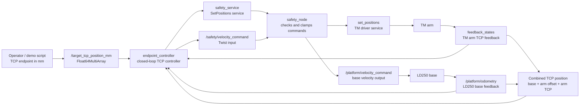
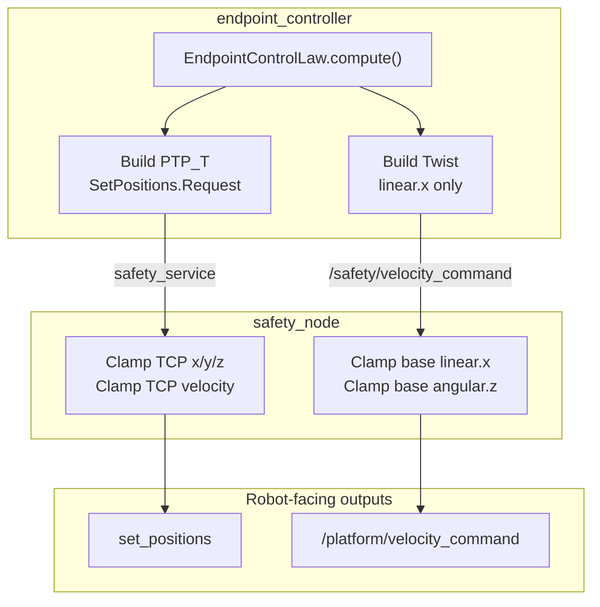
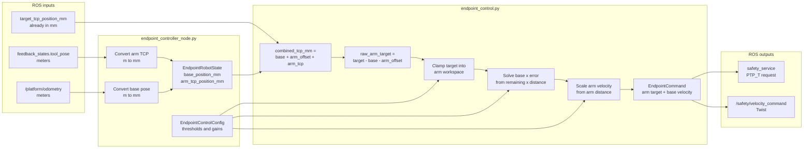
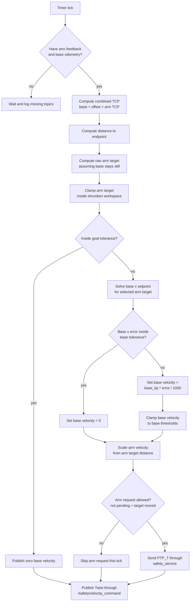
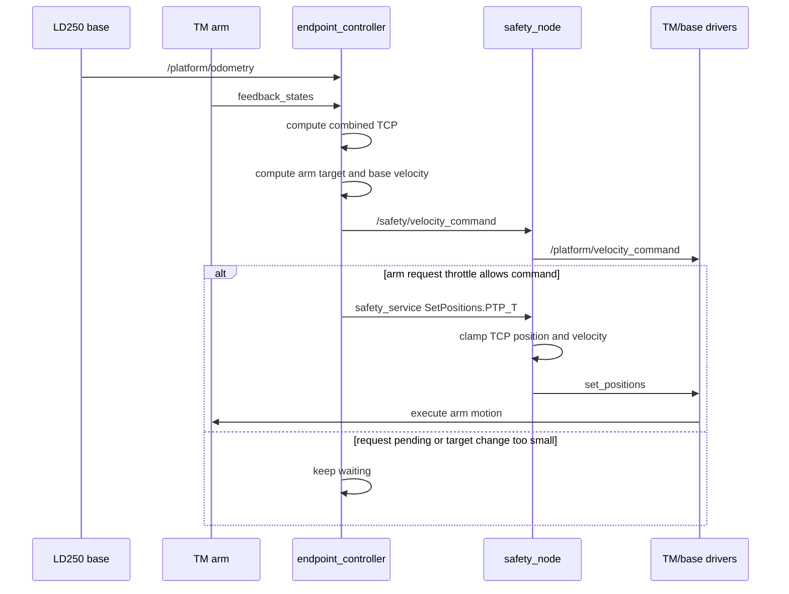
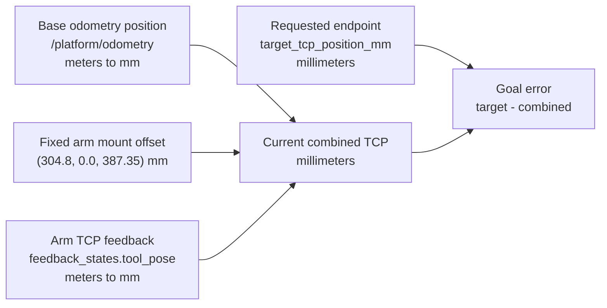
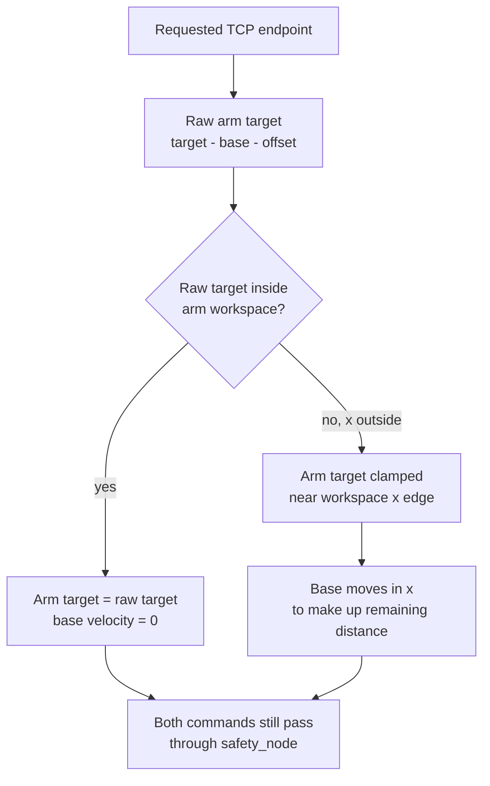

# Endpoint Controller Diagrams

These diagrams show how the safety demo works at the system level and inside
the endpoint controller.

## 1. Safety Demo Overview

This is the big picture. The endpoint controller proposes motion, but both arm
and base commands still pass through `safety_node` before reaching the robot.

## 2. Command Paths Through The Safety Node

The arm and base use different ROS interfaces, but they share the same safety
idea: the endpoint controller does not talk directly to the final actuator
interfaces.

## 3. Endpoint Controller Internals

This shows the ROS wrapper and the pure Python command law. The wrapper handles
topics, services, and unit conversions. The command law handles the math.

## 4. Control Law Decision Flow

This is the logic that runs every controller tick.

## 5. One Controller Tick Sequence

This sequence view is useful when debugging timing. Base commands are published
every tick. Arm commands are only sent when the request throttle allows it.

## 6. Frame And Unit Relationship

The endpoint target is in the combined TCP frame used by this demo. The
controller combines base odometry, fixed arm mount offset, and arm TCP feedback.

## 7. Reachable Vs. Far X Target

The same command law handles both cases.

## Reading The Logs

Useful status messages from `endpoint_controller`:

- `Waiting for feedback`: one or both feedback topics have not arrived yet.
- `Endpoint TCP controller ready`: the node started and created its interfaces.
- `distance=... base_x=... arm_target=...`: current command-law status.
- `TCP target requires clamping arm axis/axes`: target is outside the arm-only
  reachable workspace on the listed axis or axes.
- `safety_service is not available`: the controller is holding arm commands
  until `safety_node` is running.
